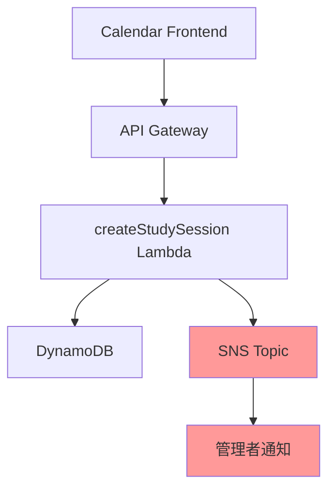

# 設計書

## 概要

勉強会登録時の管理者通知機能は、既存の勉強会カレンダーシステムにAmazon
SNSを使用した通知機能を追加します。ユーザーがカレンダー画面から勉強会を登録すると、システムは自動的にSNSトピックにメッセージを発行し、管理者に通知を送信します。この機能は既存のアーキテクチャパターンに従い、非同期処理により現在のユーザーエクスペリエンスを妨げることなく実装されます。

## アーキテクチャ

### 現在のフロー

1. ユーザーがカレンダー画面で勉強会を登録
2. API Gateway → Lambda (createStudySession) → DynamoDB

### 新しいフロー

1. ユーザーがカレンダー画面で勉強会を登録
2. API Gateway → Lambda (createStudySession) → DynamoDB
3. **新規**: Lambda内でSNSトピックにメッセージを発行
4. **新規**: SNS経由で管理者に通知送信

### アーキテクチャ図



## コンポーネントと インターフェース

### 1. SNS通知サービス (NotificationService)

**場所**: `admin-backend/src/services/NotificationService.ts`

**責任**:

- SNSトピックへのメッセージ発行
- 通知メッセージのフォーマット
- エラーハンドリング

**インターフェース**:

```typescript
interface NotificationService {
  publishStudySessionNotification(session: StudySession): Promise<void>
}
```

### 2. CDKスタック拡張

**場所**: `cdk/lib/study-session-calendar-stack.ts`

**追加要素**:

- SNSトピックリソース
- Lambda関数へのSNS発行権限
- 環境変数設定

### 3. Lambda関数の拡張

**場所**: `admin-backend/src/handlers/studySessionHandlers.ts`

**変更点**:

- `createStudySession`ハンドラーにSNS通知処理を追加
- 非同期処理によるエラーハンドリング

## データモデル

### SNS通知メッセージ構造

```typescript
interface StudySessionNotificationMessage {
  messageType: 'STUDY_SESSION_REGISTERED'
  timestamp: string
  studySession: {
    id: string
    title: string
    datetime: string
    endDatetime?: string
    url: string
    contact?: string
    registeredAt: string
  }
  summary: string // 人間が読みやすい要約
}
```

### 環境変数

既存の環境変数に以下を追加:

```typescript
{
  // 既存の環境変数...
  SNS_TOPIC_ARN: string // SNSトピックのARN
}
```

## エラーハンドリング

### 1. SNS発行失敗時の処理

- **原則**: 勉強会登録は成功させる
- **実装**: try-catch でSNS処理をラップ
- **ログ**: エラー詳細をCloudWatch Logsに記録
- **ユーザー影響**: なし（登録処理は正常完了）

### 2. エラーパターンと対応

| エラーパターン       | 対応方法           | ユーザー影響 |
| -------------------- | ------------------ | ------------ |
| SNSトピック不存在    | ログ記録、処理継続 | なし         |
| IAM権限不足          | ログ記録、処理継続 | なし         |
| SNSサービス障害      | ログ記録、処理継続 | なし         |
| メッセージ形式エラー | ログ記録、処理継続 | なし         |

### 3. ログ出力仕様

```typescript
// 成功時
logger.info('Study session notification sent', {
  sessionId: session.id,
  messageId: result.MessageId,
})

// 失敗時
logger.error('Failed to send study session notification', {
  sessionId: session.id,
  error: error.message,
  stack: error.stack,
})
```

## テスト戦略

### 1. 単体テスト

**NotificationService**:

- SNSメッセージ発行の成功ケース
- SNS発行失敗時のエラーハンドリング
- メッセージフォーマットの検証

**studySessionHandlers**:

- 通知機能付きの勉強会登録成功ケース
- SNS失敗時でも登録が成功することの検証

### 2. 統合テスト

- Lambda関数からSNSトピックへの実際のメッセージ発行
- DynamoDB登録とSNS通知の両方が正常動作することの確認

### 3. エラーシナリオテスト

- SNSトピックが存在しない場合
- IAM権限が不足している場合
- SNSサービスが一時的に利用できない場合

## AWS CDK実装詳細

### 1. SNSトピック定義

```typescript
// SNSトピック
const studySessionNotificationTopic = new sns.Topic(this, 'StudySessionNotificationTopic', {
  topicName: `${serviceName}-${environment}-sns-study-session-notification`,
  displayName: '勉強会登録通知',
})
```

### 2. Lambda権限設定

```typescript
// SNSトピックへの発行権限を付与
studySessionNotificationTopic.grantPublish(createStudySessionFunction)
```

### 3. 環境変数追加

```typescript
const lambdaEnvironment = {
  // 既存の環境変数...
  SNS_TOPIC_ARN: studySessionNotificationTopic.topicArn,
}
```

### 4. 出力値追加

```typescript
new cdk.CfnOutput(this, 'StudySessionNotificationTopicArn', {
  value: studySessionNotificationTopic.topicArn,
  description: '勉強会通知SNSトピックARN',
  exportName: `${serviceName}-${environment}-sns-topic-arn`,
})
```

## セキュリティ考慮事項

### 1. IAM権限

- Lambda関数には最小権限の原則に従い、特定のSNSトピックへの発行権限のみを付与
- SNSトピックへのアクセスは必要な Lambda関数のみに制限

### 2. データ保護

- 通知メッセージには機密情報を含めない
- 個人情報（連絡先など）は必要最小限のみ含める

### 3. 監査ログ

- すべてのSNS発行操作をCloudWatch Logsに記録
- 失敗ケースも含めて完全な監査証跡を維持

## パフォーマンス考慮事項

### 1. 非同期処理

- SNS発行は勉強会登録処理をブロックしない
- Promise.allSettled()を使用して並行処理を実装

### 2. タイムアウト設定

- 現在のLambdaタイムアウト（30秒）は十分
- SNS発行は通常数秒以内で完了

### 3. コスト最適化

- SNSメッセージサイズを最小限に抑制
- 不要な重複通知を避ける仕組み
