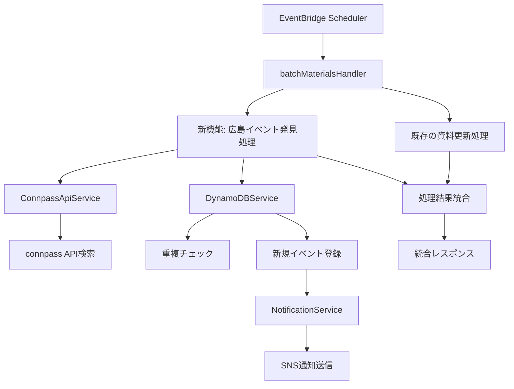

# 設計書

## 概要

広島イベント自動登録機能は、既存のバッチ処理システムに統合され、connpass
APIから広島のITイベントを自動的に発見・登録します。この機能は既存のアーキテクチャとデータフローを活用し、手動登録と同じ承認・通知プロセスを使用します。

## アーキテクチャ

### システム統合



### データフロー

1. **イベント発見フェーズ**
   - connpass API検索（キーワード：広島）
   - イベントデータ抽出・変換

2. **重複チェックフェーズ**
   - DynamoDB内の既存URLとの照合
   - 新規イベントの特定

3. **登録・通知フェーズ**
   - 新規イベントのDynamoDB登録
   - 既存通知システムでの通知送信

## コンポーネントと インターフェース

### 1. HiroshimaEventDiscoveryService

新しいサービスクラスで、広島イベント発見のコアロジックを担当します。

```typescript
interface HiroshimaEventDiscoveryService {
  discoverAndRegisterEvents(): Promise<HiroshimaDiscoveryResult>
}

interface HiroshimaDiscoveryResult {
  totalFound: number
  newRegistrations: number
  duplicatesSkipped: number
  errors: string[]
  registeredEvents: StudySession[]
}
```

### 2. ConnpassApiService拡張

既存のConnpassApiServiceに検索機能を追加します。

```typescript
interface ConnpassSearchResult {
  events: ConnpassEventData[]
  totalCount: number
}

interface ConnpassEventData {
  event_id: number
  title: string
  event_url: string
  started_at: string
  ended_at?: string
  description?: string
}

// 既存のConnpassApiServiceに追加
class ConnpassApiService {
  async searchEventsByKeyword(keyword: string, count?: number): Promise<ConnpassSearchResult>
}
```

### 3. DynamoDBService拡張

既存のDynamoDBServiceに重複チェック機能を追加します。

```typescript
// 既存のDynamoDBServiceに追加
class DynamoDBService {
  async checkEventExists(eventUrl: string): Promise<boolean>
  async createStudySessionFromConnpass(eventData: ConnpassEventData): Promise<StudySession>
}
```

### 4. batchMaterialsHandler拡張

既存のバッチハンドラーに広島イベント発見処理を統合します。

```typescript
interface BatchUpdateResult {
  // 既存フィールド
  processedCount: number
  successCount: number
  errorCount: number
  errors?: string[]

  // 新規追加フィールド
  hiroshimaDiscovery?: HiroshimaDiscoveryResult
}
```

## データモデル

### ConnpassEventDataからStudySessionへの変換

```typescript
const convertConnpassToStudySession = (eventData: ConnpassEventData): CreateStudySessionRequest => {
  return {
    title: eventData.title,
    url: eventData.event_url,
    datetime: eventData.started_at,
    endDatetime: eventData.ended_at,
    // contactは設定しない（connpass APIには含まれない）
  }
}
```

### DynamoDBスキーマ

既存のStudySessionスキーマをそのまま使用：

```typescript
interface StudySession {
  id: string // 自動生成
  title: string // connpass event title
  url: string // connpass event URL
  datetime: string // connpass started_at
  endDatetime?: string // connpass ended_at
  contact?: string // 未設定（connpassには含まれない）
  status: 'pending' // 常にpending（承認待ち）
  createdAt: string // 現在時刻
  updatedAt: string // 現在時刻
}
```

## エラーハンドリング

### エラー分類と対応

1. **connpass API エラー**
   - 認証エラー（401）: ログ記録、処理継続
   - レート制限エラー（429）: 待機後リトライ（1回のみ）
   - その他APIエラー: ログ記録、処理継続

2. **DynamoDB エラー**
   - 重複チェックエラー: ログ記録、該当イベントスキップ
   - 登録エラー: ログ記録、該当イベントスキップ

3. **通知エラー**
   - SNS送信エラー: ログ記録、登録は成功として継続

### エラー回復戦略

- **部分的失敗許容**: 一部のイベント処理が失敗しても、他のイベントの処理は継続
- **ログベース監視**: 詳細なエラーログで後続の手動対応を支援
- **既存処理への影響回避**: 広島イベント発見の失敗は既存の資料更新処理に影響しない

## テスト戦略

### 単体テスト

1. **HiroshimaEventDiscoveryService**
   - connpass API検索結果の正常処理
   - 重複イベントのスキップ
   - 新規イベントの登録
   - エラーハンドリング

2. **ConnpassApiService拡張**
   - キーワード検索API呼び出し
   - レスポンスデータの変換
   - APIエラーハンドリング

3. **DynamoDBService拡張**
   - 重複チェック機能
   - connpassイベントからの登録

### 統合テスト

1. **バッチ処理統合**
   - 既存処理との並行実行
   - 統合レスポンスの生成
   - エラー時の処理継続

2. **通知システム統合**
   - 既存NotificationServiceとの連携
   - 通知内容の検証

### E2Eテスト

1. **完全なバッチ実行フロー**
   - EventBridgeからの実行
   - 広島イベント発見・登録・通知の完全フロー
   - 管理画面での承認フロー確認

## パフォーマンス考慮事項

### APIレート制限対応

- connpass API制限: 1秒間に1リクエスト
- 実装では5秒間隔で余裕を持った制限
- 既存の資料更新処理との独立したレート制限管理

### メモリ使用量

- 検索結果は一度に全て取得（最大100件想定）
- イベントデータは軽量（タイトル、URL、日時のみ）
- 既存のLambdaメモリ設定で十分対応可能

### 実行時間

- connpass API検索: 1回のみ（5秒待機含む）
- DynamoDB操作: 検索結果件数分（通常10件以下想定）
- 全体で30秒以内の追加実行時間を想定

## セキュリティ考慮事項

### APIキー管理

- 既存のSecretsManagerServiceを使用
- connpass APIキーは既存の資料更新処理と共有

### データ検証

- connpass APIレスポンスの必須フィールド検証
- URL形式の検証（connpass.comドメイン確認）
- 日時形式の検証とISO変換

### 権限管理

- 既存のLambda実行ロールを使用
- DynamoDB、SNS、SecretsManagerの既存権限で対応

## 運用考慮事項

### 監視とアラート

- CloudWatchログでの詳細ログ出力
- エラー率の監視（既存のバッチ処理監視に統合）
- 新規登録イベント数の監視

### 設定管理

- 検索キーワード「広島」はハードコード（要件に基づく）
- 検索件数上限は100件（connpass API制限）
- レート制限間隔は5秒（設定可能にする）

### バックアップと復旧

- DynamoDBの既存バックアップ戦略を使用
- 誤登録時の手動削除機能（既存の管理画面を使用）
