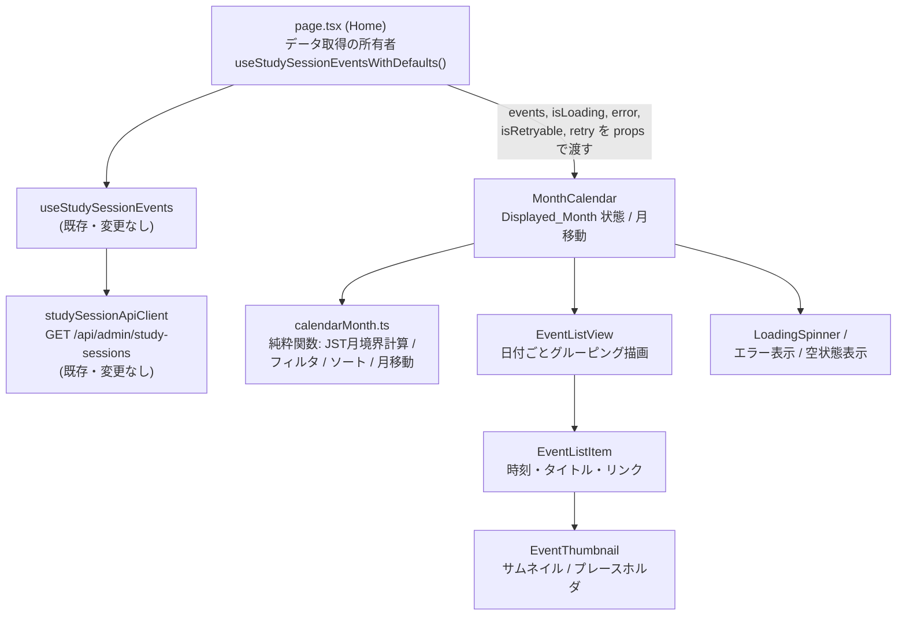
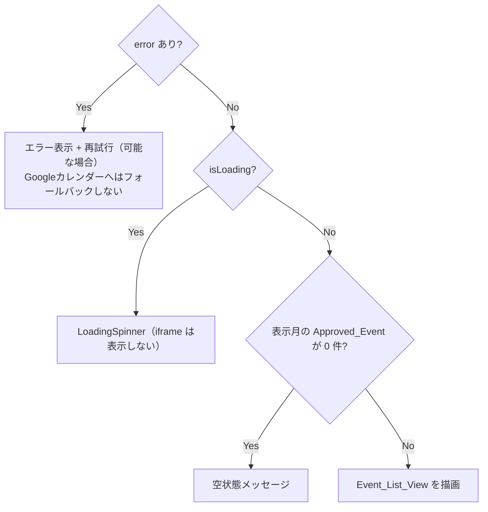
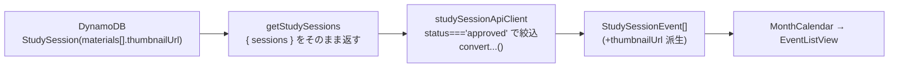

# 設計ドキュメント: オリジナルカレンダーUI

## Overview

エンドユーザー向けカレンダー画面（`calendar/`）のカレンダー表示を、Google カレンダーの `<iframe>`
埋め込みから、自前実装のオリジナルカレンダー UI へ置き換える。

イベントデータは新規に取得せず、`page.tsx` が既に呼び出している
`useStudySessionEventsWithDefaults()` が返す `events` 配列をそのまま利用する（Requirement
2.8）。カレンダーは月単位で表示し、前月・翌月へ移動できる（Requirement 3,
4）。表示形式は現状の Google カレンダー予定リスト表示をベースとした、日付ごとにイベントを縦に並べるリスト（Event_List_View）とし、各イベントに小さなサムネイル画像を添える（Requirement
5, 6）。

本設計での重要な結論（Requirement 7）:

バックエンド `GET /api/admin/study-sessions`（`getStudySessions` ハンドラ）は
`DynamoDBService.getStudySessions()` の結果を `{ sessions }`
としてフィールドの射影・除去なしにそのまま返す。`StudySession` 型は既に `materials?: Material[]`
を持ち、 `Material` は `thumbnailUrl?: string` を持つ。したがってサムネイルURLは
**すでにレスポンスに含まれている**（資料を持つイベントの場合）。フロントエンドが現状その情報を破棄しているだけである。よって
**バックエンドの変更は不要** で、Requirement
7.2 は既存挙動で満たされる。必要なのはフロントエンドの型定義と変換関数の更新のみである（詳細は Data
Models と「Backend Impact」を参照）。

### 対象範囲

| 区分           | 内容                                                                                                                 |
| -------------- | -------------------------------------------------------------------------------------------------------------------- |
| 置き換え対象   | `calendar/app/page.tsx` 内の Google カレンダー `<iframe>` ブロック                                                   |
| 新規追加       | オリジナルカレンダーコンポーネント群（`MonthCalendar` など）                                                         |
| 型・変換の更新 | `StudySessionApiResponse` / `StudySessionEvent` / `convertApiResponseToStudySessionEvent`                            |
| 維持           | `ResponsiveHeaderButtons`、`MobileRegisterSection`、エラー表示、空状態表示、`EventMaterialsList`（イベント資料一覧） |
| 変更なし       | バックエンド（`admin-backend`）一式                                                                                  |

### 前提となる既存コードの事実

| 対象                       | 事実                                                                                                                                                              |
| -------------------------- | ----------------------------------------------------------------------------------------------------------------------------------------------------------------- |
| `page.tsx`                 | `useStudySessionEventsWithDefaults(pageUrl)` を呼び、`{ events, isLoading, error, isRetryable, retry, isFallbackMode }` を取得済み。iframe ブロックのみ差し替える |
| `useStudySessionEvents`    | 初回マウントで自動取得。`events: StudySessionEvent[]` を返す。二重取得はしない                                                                                    |
| `studySessionApiClient`    | `GET ${baseUrl}/api/admin/study-sessions`、`{ sessions }` を期待、`status==='approved'` で絞り込み、タイムアウト 10 秒                                            |
| `StudySessionApiResponse`  | 現状サムネイル/資料フィールドなし                                                                                                                                 |
| `StudySessionEvent`        | 現状 `thumbnailUrl` なし。`startDate`/`endDate` は `Date`                                                                                                         |
| backend `getStudySessions` | `{ sessions }` をそのまま返す。`materials[].thumbnailUrl` を含み得る                                                                                              |
| 再利用可能な UI            | `LoadingSpinner`、`OptimizedImage` / `OptimizedThumbnail`、`ImageErrorFallback`                                                                                   |

## Architecture

### コンポーネント構成方針

`page.tsx` はデータ取得の単一の所有者であり続ける。取得済みの状態（`events`, `isLoading`, `error`,
`isRetryable`, `retry`）を新規の `MonthCalendar`
コンポーネントへ props として渡す（データ取得を子へ移さない）。これにより Requirement
2.8（既存取得手段の再利用）と「二重フェッチ禁止」を同時に満たす。

`MonthCalendar`
は表示月（Displayed_Month）の状態と月移動のみを担い、表示対象イベントの算出（JST 月境界フィルタ + ソート）は純粋関数ユーティリティ（`calendarMonth.ts`）に委譲する。リスト描画は
`EventListView`、各行は `EventListItem`、サムネイルは `EventThumbnail`
が担当する（単一責任の原則）。



### 表示状態の優先順位

`MonthCalendar` は次の優先順で表示を決定する（Requirement 2.7: エラーが空状態に優先）。



判定順序が「error → loading → empty → list」であることが重要で、これにより Requirement
2.7（取得失敗と 0 件が同時発生した場合はエラーを優先）を保証する。

### JST 月境界の計算方針

サーバーやブラウザのローカルタイムゾーンに依存せず、JST（UTC+9）固定で Displayed_Month の境界を算出する（Requirement
3.4）。実行環境のタイムゾーンに依存する `Date#getMonth()`
などは判定に用いず、UTC ベースのミリ秒で JST の月初 00:00:00 と月末 23:59:59.999 を構築する。

- JST 月初（UTC 換算）= `Date.UTC(year, month, 1, 0, 0, 0) - 9h`
- JST 翌月初（UTC 換算）= `Date.UTC(year, month + 1, 1, 0, 0, 0) - 9h`
- 判定は「月初 <= event.startDate < 翌月初」の半開区間で行う。これは「末日 23:59:59
  JST まで含む」と等価であり、末日の 23:59:59.xxx を漏れなく含められる（Requirement 3.4）。

初回表示月は `new Date()` を JST に射影して算出する（Requirement 3.2）。

## Components and Interfaces

### 1. `MonthCalendar`（新規）

役割:
Displayed_Month の状態管理、月移動、表示状態（loading/error/empty/list）の分岐。データ取得はしない。

配置: `calendar/app/components/MonthCalendar.tsx`

```typescript
export interface MonthCalendarProps {
  /** page.tsx が取得済みのイベント（Approved 以外も含みうる。内部で絞り込み） */
  events: StudySessionEvent[]
  /** 取得中フラグ */
  isLoading: boolean
  /** エラーメッセージ（null なら正常） */
  error: string | null
  /** 再試行可能か */
  isRetryable: boolean
  /** 再試行ハンドラ */
  onRetry: () => void
  /** 追加クラス */
  className?: string
}
```

要件対応: 1.1, 1.4, 1.5, 2.4, 2.5, 2.6, 2.7, 3.1〜3.4, 4.1〜4.6, 8.1〜8.3

内部状態:

```typescript
// JST の現在年月で初期化（Requirement 3.2）
const [displayedMonth, setDisplayedMonth] = useState<YearMonth>(() => getCurrentYearMonthJst())
```

月移動ハンドラ（Requirement 4.2, 4.3, 4.6）:

```typescript
const goPrevMonth = () => {
  if (isLoading) return // Req 4.6: 取得未完了なら無視
  setDisplayedMonth(prev => addMonths(prev, -1))
}
const goNextMonth = () => {
  if (isLoading) return // Req 4.6
  setDisplayedMonth(prev => addMonths(prev, 1))
}
```

月移動ボタンには読み込み中は `disabled` を付与し、`aria-label`
（例: 「前の月へ」「次の月へ」）を必ず付ける（Requirement 4.6, 8.3）。

### 2. `EventListView`（新規）

役割: 与えられた表示対象イベント（フィルタ・ソート済み）を日付ごとにグルーピングして描画。

配置: `calendar/app/components/EventListView.tsx`

```typescript
export interface EventListViewProps {
  /** 表示対象（Displayed_Month に含まれ、Approved で、ソート済み） */
  events: StudySessionEvent[]
}
```

要件対応: 5.1, 5.2, 5.3, 5.4, 5.5, 8.1, 8.2

描画方針:

- `groupEventsByJstDate()` で日付（JST の年月日）ごとにまとめる（Requirement 5.3）。
- 各日付見出しに「年月日 + 曜日」を JST で表示（Requirement 5.2）。
- 0 件時は当月に表示できるイベントがない旨のメッセージ（Requirement 5.5）。なお 0 件表示は
  `MonthCalendar` の空状態分岐と重複しないよう、空状態の描画責務は `MonthCalendar`
  側に集約し、`EventListView` は 1 件以上のときのみレンダリングされる。

### 3. `EventListItem`（新規）

役割: 単一イベント行。開始時刻（時分）・タイトル・イベントページリンク・サムネイルを表示。

配置: `calendar/app/components/EventListItem.tsx`

```typescript
export interface EventListItemProps {
  event: StudySessionEvent
}
```

要件対応: 5.2, 5.4, 6.1〜6.4, 8.4, 8.5

- 開始時刻は JST の時分で表示（Requirement 5.2）。
- `event.pageUrl` があればリンクを提供（`target="_blank"` +
  `rel="noopener noreferrer"`）（Requirement 5.4）。
- サムネイルは `EventThumbnail` に委譲。

### 4. `EventThumbnail`（新規）

役割: サムネイル表示とプレースホルダ処理。単一責任でサムネイルの有無・エラーを扱う。

配置: `calendar/app/components/EventThumbnail.tsx`

```typescript
export interface EventThumbnailProps {
  /** 派生済みサムネイルURL（未設定/空/空白/無効なら未表示） */
  thumbnailUrl?: string
  /** alt に使うイベントタイトル（識別テキスト） */
  eventTitle: string
}
```

要件対応: 6.1〜6.4, 8.4, 8.5

- `isDisplayableThumbnailUrl(thumbnailUrl)` が真のときのみ画像を表示（Requirement 6.1, 7.4, 7.5）。
- 表示時は一辺 64px 以下（`OptimizedThumbnail` の `variant="table"` を利用、幅 64
  / 高さ 48 など）（Requirement 6.4）。
- 画像読み込み失敗時はデフォルト代替画像を使わず、レイアウトを保つ空のプレースホルダ領域とする（Requirement
  6.3）。`OptimizedImage` の `onError` によるプレースホルダ挙動を利用する。
- サムネイルありのとき `alt`
  はイベントタイトルを優先。タイトルが空なら汎用ラベル（例: 「イベントのサムネイル」）を用いる（Requirement
  8.4）。
- サムネイルなし表示は装飾扱いとし、代替テキストを必要としない（`aria-hidden` 相当）（Requirement
  8.5）。

### 5. 純粋関数ユーティリティ `calendarMonth.ts`（新規）

役割: 月境界計算・フィルタ・ソート・月移動・グルーピングの純粋ロジック。UI から分離し、プロパティベーステストの対象とする。

配置: `calendar/app/utils/calendarMonth.ts`

```typescript
export interface YearMonth {
  year: number // 西暦
  month: number // 0-11（JS の月インデックス。JST 基準）
}

/** JST の現在年月を返す（Requirement 3.2） */
export function getCurrentYearMonthJst(now?: Date): YearMonth

/** 暦上の月加算。year ロールオーバー対応（Requirement 4.2, 4.3） */
export function addMonths(ym: YearMonth, delta: number): YearMonth

/** JST 月初（含む）と翌月初（含まない）を UTC の Date で返す（Requirement 3.4） */
export function getJstMonthRange(ym: YearMonth): { start: Date; endExclusive: Date }

/** startDate が JST 月境界に含まれる Approved のみ抽出（Requirement 2.3, 3.4） */
export function filterEventsInMonth(events: StudySessionEvent[], ym: YearMonth): StudySessionEvent[]

/** 開始日時昇順、同時刻はタイトル昇順で安定ソート（Requirement 5.1） */
export function sortEventsForDisplay(events: StudySessionEvent[]): StudySessionEvent[]

/** 表示用: フィルタ + ソートを合成（Approved 絞り込み含む） */
export function selectEventsForMonth(
  events: StudySessionEvent[],
  ym: YearMonth
): StudySessionEvent[]

/** JST の年月日キー（YYYY-MM-DD）でグルーピング（Requirement 5.3） */
export function groupEventsByJstDate(
  events: StudySessionEvent[]
): { dateKey: string; events: StudySessionEvent[] }[]

/** 年月ラベル（例: 2025年6月）を JST で生成（Requirement 3.3, 4.4） */
export function formatYearMonthLabel(ym: YearMonth): string
```

### 6. サムネイルURL検証 `thumbnailUrl.ts`（新規）

役割: サムネイルURLの有効性判定を単一責任で提供。

配置: `calendar/app/utils/thumbnailUrl.ts`

```typescript
/**
 * 表示可能なサムネイルURLか判定する。
 * 空文字・空白のみ・未定義・無効なURL は false（Requirement 6.2, 7.4, 7.5）。
 * http/https の絶対URLのみ true とする。
 */
export function isDisplayableThumbnailUrl(url?: string): boolean
```

### 7. `page.tsx` の変更

- Google カレンダー `<iframe>` ブロックと、それに付随する `calendarUrl`
  によるローディング分岐を削除し、`<MonthCalendar events={events} isLoading={isEventsLoading} error={eventsError} isRetryable={isRetryable} onRetry={retry} />`
  を配置する（Requirement 1.1, 1.2, 1.4, 1.5）。
- `ResponsiveHeaderButtons`、`MobileRegisterSection`、`EventMaterialsList`
  （イベント資料一覧）は現状のまま維持（Requirement 1.3）。
- `NEXT_PUBLIC_GOOGLE_CALENDAR_URL` を `src` に持つ `<iframe>`
  を DOM から完全に除去する（Requirement 1.2）。`calendarUrl`
  state はカレンダー表示には不要になるが、シェアテキスト用にフックへ渡す `pageUrl`
  とは別物である点に注意（現状 `useStudySessionEventsWithDefaults(pageUrl)`
  を呼んでいるためこの呼び出しは維持）。

## Data Models

### フロントエンド型の変更

Requirement
7.1〜7.3 に従い、サムネイルURLを単一の文字列フィールドとして表現できるようにする。バックエンドは
`materials?: Material[]`（各 `Material` に
`thumbnailUrl?`）を返すため、フロントの API レスポンス型に任意の `materials`
を追加し、変換時に単一の `thumbnailUrl` を派生させる。

`StudySessionApiResponse`（`calendar/app/types/studySessionEvent.ts`）:

```typescript
/** バックエンド Material の部分型（サムネイル参照に必要な範囲のみ） */
export interface StudySessionMaterialApiResponse {
  thumbnailUrl?: string
  // 他フィールド（id/title/url/type など）は本機能では不要のため任意扱い
  [key: string]: unknown
}

export interface StudySessionApiResponse {
  id: string
  title: string
  url: string
  datetime: string
  endDatetime?: string
  status: StudySessionStatus
  createdAt: string
  updatedAt: string
  contact?: string
  /** 追加: 資料配列（存在する場合のみ）。サムネイル派生に使用（Requirement 7.2, 7.3） */
  materials?: StudySessionMaterialApiResponse[]
}
```

`StudySessionEvent`:

```typescript
export interface StudySessionEvent {
  id: string
  title: string
  startDate: Date
  endDate: Date
  status: StudySessionStatus
  pageUrl?: string
  createdAt?: string
  updatedAt?: string
  /** 追加: 単一のサムネイルURL（無ければ undefined）（Requirement 7.1, 7.3） */
  thumbnailUrl?: string
}
```

`convertApiResponseToStudySessionEvent` の更新（Requirement 7.1）:

```typescript
export function convertApiResponseToStudySessionEvent(
  apiResponse: StudySessionApiResponse
): StudySessionEvent {
  // 最初に thumbnailUrl を持つ material から単一URLを派生
  const thumbnailUrl = apiResponse.materials?.find(
    m => typeof m?.thumbnailUrl === 'string' && m.thumbnailUrl.trim() !== ''
  )?.thumbnailUrl

  return {
    id: apiResponse.id,
    title: apiResponse.title,
    startDate: new Date(apiResponse.datetime),
    endDate: apiResponse.endDatetime
      ? new Date(apiResponse.endDatetime)
      : new Date(apiResponse.datetime),
    status: apiResponse.status,
    pageUrl: apiResponse.url,
    createdAt: apiResponse.createdAt,
    updatedAt: apiResponse.updatedAt,
    thumbnailUrl, // 空/空白/無しは undefined 相当（表示側で最終判定）
  }
}
```

型ガード `isValidStudySessionApiResponse` の更新（Requirement 7.2, 7.3）:

現状の型ガードは必須フィールドの肯定的チェックのみで、未知フィールドは無視するため `materials`
を追加してもバリデーションは壊れない。ただし `materials`
が存在する場合に配列であることを緩く検証し、正当なレスポンスを弾かないようにする。

```typescript
export function isValidStudySessionApiResponse(data: any): data is StudySessionApiResponse {
  return (
    typeof data === 'object' &&
    data !== null &&
    typeof data.id === 'string' &&
    typeof data.title === 'string' &&
    typeof data.url === 'string' &&
    typeof data.datetime === 'string' &&
    ['approved', 'pending', 'rejected'].includes(data.status) &&
    typeof data.createdAt === 'string' &&
    typeof data.updatedAt === 'string' &&
    (data.endDatetime === undefined || typeof data.endDatetime === 'string') &&
    (data.contact === undefined || typeof data.contact === 'string') &&
    // 追加: materials は無いか、配列であること（要素の厳密検証はしない）
    (data.materials === undefined || Array.isArray(data.materials))
  )
}
```

### データフロー要約



## Correctness Properties

プロパティとは、システムのすべての正当な実行にわたって成り立つべき特性・振る舞いであり、システムが何をすべきかについての形式的な言明である。プロパティは、人間可読な仕様と、機械検証可能な正しさ保証との橋渡しとなる。

本機能では、UI 描画そのものではなく、UI から分離した純粋関数ロジック（`calendarMonth.ts`、`thumbnailUrl.ts`、`convertApiResponseToStudySessionEvent`）をプロパティベーステストの対象とする。描画・レスポンシブ・アクセシビリティ属性など入力によって意味的に変化しない受入基準は、Testing
Strategy に記載の例示・統合テストで検証する。

### Property 1: 月内表示対象は「承認済み」かつ「JST 月境界内」と同値

_For any_ イベント配列と任意の Displayed_Month（YearMonth）について、`selectEventsForMonth`
の出力にイベントが含まれることは、そのイベントが `status === 'approved'` であり、かつ `startDate`
が当該月の JST 月初 00:00:00（含む）から翌月初（含まない、すなわち末日 23:59:59
JST まで）の半開区間に入ることと、必要十分（同値）である。

**Validates: Requirements 2.3, 3.1, 3.4, 4.5**

### Property 2: 月移動は暦算術と一致し、前後移動は逆操作

_For any_ YearMonth について、`addMonths(ym, +1)` の直後に `addMonths(_, -1)`
を適用すると元の YearMonth に戻る（逆操作）。また `addMonths`
は暦上の月加算に一致し、12 月の翌月は翌年 1 月、1 月の前月は前年 12 月となる（年のロールオーバー）。

**Validates: Requirements 4.2, 4.3**

### Property 3: 初回表示月は与えられた時刻の JST 年月と一致

_For any_ 時刻（Date インスタンス）について、`getCurrentYearMonthJst(now)`
は、その時刻を UTC+9 に射影したときの西暦年および月（0-11）と一致する。

**Validates: Requirements 3.2**

### Property 4: 表示ソートは安定な昇順で入力の置換である

_For any_ イベント配列について、`sortEventsForDisplay`
の出力は、(1) 入力と同じ多重集合（置換）であり要素数が保存され、(2) 隣接する任意の 2 要素が「開始日時の昇順、開始日時が等しい場合はタイトルの昇順」を満たす。

**Validates: Requirements 5.1**

### Property 5: 日付グルーピングは入力の分割で、キーは JST 日付と一致し一意

_For any_ イベント配列について、`groupEventsByJstDate` の結果は、(1) 各グループの `dateKey`
が一意であり、(2) 各イベントは自身の JST 年月日と等しい `dateKey`
のグループにのみ属し、(3) 全グループのイベントの和集合が入力と一致する（分割）。

**Validates: Requirements 5.3**

### Property 6: サムネイル表示可否は URL の有効性と同値

_For any_ 文字列または未定義値について、`isDisplayableThumbnailUrl`
は、値が undefined・空文字・空白のみ・http/https 以外または解析不能な無効 URL のいずれかであるとき false を返し、http/https の絶対 URL であるときのみ true を返す。サムネイルが表示されることは、この判定が true であることと同値である。

**Validates: Requirements 6.1, 6.2, 7.4, 7.5**

### Property 7: 変換後サムネイルは単一の非空文字列または未定義

_For any_ API レスポンス（`materials` は任意の内容・順序）について、
`convertApiResponseToStudySessionEvent` が導出する `thumbnailUrl` は、`materials` の中で
`thumbnailUrl`
が非空文字列である最初の要素の値（トリム前の元値）であるか、そのような要素が存在しない場合は undefined であり、いずれの場合も「単一の文字列または未定義」である。

**Validates: Requirements 7.1**

### Property 8: 年月ラベルは対象の年と月を含む

_For any_ YearMonth について、`formatYearMonthLabel`
が返す文字列は、その年（西暦）と月（1-12 表記）の両方を可読な形で含む。

**Validates: Requirements 3.3, 4.4**

## Error Handling

### データ取得エラー（Requirement 1.5, 2.6, 2.7, 5.6）

- 取得エラーは `useStudySessionEvents` が `error` / `isRetryable` / `retry` として公開する。
  `MonthCalendar` はこれらを props で受け取り、`error !== null`
  のときエラー表示を最優先で描画する（loading・empty・list より優先）。
- エラー時に Google カレンダー iframe へフォールバックしない（Requirement
  1.5）。代わりに取得失敗メッセージと、`isRetryable` のとき再試行ボタン（`onRetry`）を提示する。
- 直前に取得済みのデータ保持は既存フックの責務であり、本機能では新たに破棄しない（Requirement
  2.6）。
- 取得失敗と表示対象 0 件が同時発生した場合、上記の優先順位によりエラー表示が空状態表示に優先する（Requirement
  2.7）。

### 個別イベントの検証・パースエラー（Requirement 5.7）

- 取得自体は成功したが個別イベントに不正フィールドがある場合でも一覧描画を継続する。日時パース（`new Date(...)`）が
  `Invalid Date` になり得るため、`filterEventsInMonth` と `sortEventsForDisplay` は無効な
  `startDate`（`isNaN(getTime())`）を持つイベントを表示対象から静かに除外し、他のイベントの描画を妨げない。

### サムネイル画像の読み込みエラー（Requirement 6.3）

- `EventThumbnail` は `OptimizedImage` の `onError`
  を用い、失敗時にデフォルト代替画像を使わず空のプレースホルダ領域を維持する。行のレイアウトは崩さない。

### タイムゾーンの堅牢性

- 月境界判定は実行環境ローカルタイムゾーンに依存せず JST 固定で計算する（Architecture の「JST 月境界の計算方針」参照）。これによりサーバー／ブラウザのタイムゾーン差異による表示ズレを防ぐ。

## Testing Strategy

テストランナーは既存の Vitest（`calendar/vitest.config.ts`）を使用する。純粋関数ロジックにはプロパティベーステスト、UI・状態遷移・レスポンシブ・アクセシビリティには例示（React
Testing Library）と統合テストを用いる二層構成とする。

### プロパティベーステスト（対象: 純粋関数ロジック）

- ライブラリはゼロから実装せず、Vitest と統合しやすい `fast-check`
  を採用する（TypeScript/JS 標準的な選択肢）。未導入の場合は `calendar`
  の devDependency に追加する。
- 各プロパティテストは最低 100 回のイテレーションで実行する（`fc.assert(fc.property(...), { numRuns: 100 })`）。
- 各テストには対応する設計プロパティを参照するコメントタグを付ける。タグ形式:
  `Feature: 07-original-calendar-ui, Property {番号}: {プロパティ本文}`
- 各 Correctness Property は単一のプロパティベーステストで実装する。
- 対象ファイルと想定テスト:

| 設計プロパティ | 対象関数                                | テストファイル（想定）                                            |
| -------------- | --------------------------------------- | ----------------------------------------------------------------- |
| Property 1     | `selectEventsForMonth`                  | `calendar/app/utils/__tests__/calendarMonth.property.test.ts`     |
| Property 2     | `addMonths`                             | 同上                                                              |
| Property 3     | `getCurrentYearMonthJst`                | 同上                                                              |
| Property 4     | `sortEventsForDisplay`                  | 同上                                                              |
| Property 5     | `groupEventsByJstDate`                  | 同上                                                              |
| Property 6     | `isDisplayableThumbnailUrl`             | `calendar/app/utils/__tests__/thumbnailUrl.property.test.ts`      |
| Property 7     | `convertApiResponseToStudySessionEvent` | `calendar/app/types/__tests__/studySessionEvent.property.test.ts` |
| Property 8     | `formatYearMonthLabel`                  | `calendar/app/utils/__tests__/calendarMonth.property.test.ts`     |

ジェネレータ方針: イベントは
`id`/`title`（Unicode 含む）/`status`（approved/pending/rejected を一様に）/`startDate`（月境界近傍を含む広い日時範囲）を生成し、月境界の等号・半開区間のエッジ（末日 23:59:59.999
JST、翌月初 00:00:00
JST）を確実に含める。サムネイル URL は空文字・空白のみ・非 http(s)・不正 URL・正当な https
URL を織り交ぜる。

### 例示・単体テスト（対象: UI と状態遷移）

- `MonthCalendar`: 表示状態の優先順位（error > loading > empty > list）を状態別に検証（Requirement
  1.4, 1.5, 2.4, 2.5, 2.6, 2.7, 5.6）。
- 月移動: 前月・翌月クリックでラベルが更新されること、読み込み中はクリックが無視されラベルが変わらないこと（Requirement
  4.1, 4.4, 4.6）。
- `EventListItem`: 年月日・曜日・開始時刻（時分）・タイトルの表示、`pageUrl`
  有無によるリンク表示の切り替え（Requirement 5.2, 5.4）。
- `EventThumbnail`: 64px 以下の寸法、`onError`
  時の空プレースホルダ、alt のタイトル優先／汎用ラベルフォールバック、サムネイルなし時の装飾扱い（Requirement
  6.3, 6.4, 8.4, 8.5）。
- レスポンシブ: 768px 未満／以上でのレイアウト、月移動操作要素のアクセシブルネーム（Requirement 8.1,
  8.2, 8.3）。

### 統合テストの更新（既存テストの改修が必須）

`calendar/app/test/integration/page.integration.test.tsx`
は現状 Google カレンダー iframe の存在（`getByTitle('広島IT勉強会カレンダー')` や `src` に
`calendar.google.com`
を含む等）をアサートしている。iframe を廃止するため、これらのアサーションは失敗する。以下へ更新する。

- iframe 関連アサーションを削除し、代わりに「`NEXT_PUBLIC_GOOGLE_CALENDAR_URL` を `src`
  に持つ iframe が 0 個であること」を検証する（Requirement 1.2）。
- 新カレンダー（`MonthCalendar`）が描画されること、イベント資料一覧セクションとヘッダーボタンが同時に存在すること（Requirement
  1.1, 1.3）。
- 見出しレベル数などの構造アサーションは新 DOM 構造に合わせて調整する。

### PBT を使わない箇所の根拠

以下は入力によって振る舞いが意味的に変化せず、100 回反復が 1〜3 例より多くのバグを見つけないため、プロパティベーステストの対象外とする。

- iframe 廃止・カレンダー描画・資料一覧との共存（Requirement 1.1〜1.5）: DOM 構造の例示検証。
- タイムアウト 10 秒（Requirement 2.2）: 既存クライアントの定数確認（スモーク）。
- レスポンシブレイアウト・アクセシブルネーム・alt/装飾扱い（Requirement 8.\*）: レンダリング検証。
- サムネイル寸法・読み込み失敗プレースホルダ（Requirement 6.3, 6.4）: レンダリング検証。

## Backend Impact

**結論: バックエンド（`admin-backend`）の変更は不要。**

根拠:

- `getStudySessions`（`admin-backend/src/handlers/studySessionHandlers.ts`）は
  `DynamoDBService.getStudySessions()` の結果を `{ sessions }`
  として、フィールドの射影・除去なしにそのまま返している。
- `StudySession`（`admin-backend/src/types/StudySession.ts`）は既に `materials?: Material[]`
  を含み、`Material`（`EventMaterial.ts`）は `thumbnailUrl?: string` を含む。
- したがって、資料を持つイベントについては `materials[].thumbnailUrl` が
  **すでにレスポンスに含まれている**。Requirement
  7.2 の「参照フィールドが無ければ追加する」は、既存レスポンスが当該参照フィールド（`materials[].thumbnailUrl`）を含んでいるため、既存挙動で満たされる。

必要な変更はフロントエンドのみ:

1. `StudySessionApiResponse` に任意の `materials?: StudySessionMaterialApiResponse[]`
   を追加（Requirement 7.3）。
2. `StudySessionEvent` に任意の `thumbnailUrl?: string` を追加（Requirement 7.1, 7.3）。
3. `convertApiResponseToStudySessionEvent` で最初の有効な `thumbnailUrl` を単一値として派生。
4. `isValidStudySessionApiResponse` を、`materials`
   が存在する場合は配列であることのみ緩く検証するよう更新（正当なレスポンスを弾かない）。

これらは既存のデータ取得手段（`studySessionApiClient` /
`useStudySessionEvents`）をそのまま再利用し、二重フェッチを導入しない（Requirement 2.8）。
