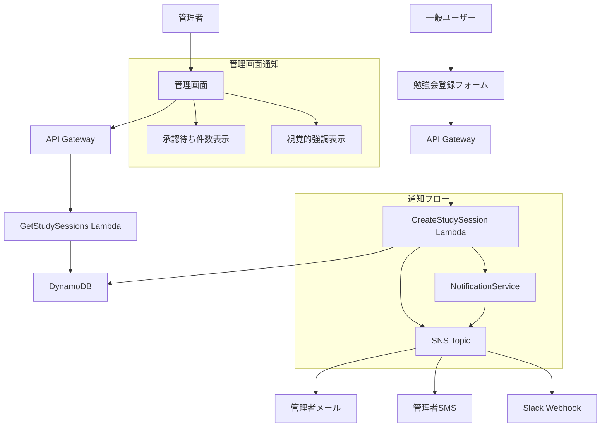

# 管理者通知機能 設計書

## 概要

この設計書は、一般ユーザーが勉強会を登録した際に管理者に自動通知を送信する機能の技術的な実装方針を定義します。Amazon
SNSを使用してリアルタイム通知を実現し、管理画面での視覚的な通知表示も含みます。

## アーキテクチャ

### システム構成図



### 通知フロー

1. **勉強会登録**: ユーザーが勉強会を登録
2. **データ保存**: DynamoDBに勉強会データを保存
3. **通知送信**: SNSトピックにメッセージを発行
4. **配信**: 設定されたサブスクライバー（メール、SMS、Webhook等）に通知配信
5. **管理画面更新**: 管理者が画面アクセス時に承認待ち件数を表示

## コンポーネントと インターフェース

### 1. NotificationService

新しく作成する通知サービスクラス

```typescript
interface NotificationService {
  sendNewStudySessionNotification(session: StudySession): Promise<void>
  isNotificationEnabled(): boolean
}
```

**責務:**

- SNS通知の送信
- 通知設定の管理
- エラーハンドリング

### 2. SNS Topic

**リソース名:** `admin-notification-topic`

**メッセージ形式:**

```json
{
  "Subject": "【広島IT勉強会カレンダー】新しい勉強会が登録されました",
  "Message": {
    "title": "勉強会タイトル",
    "datetime": "2024-01-15T19:00:00.000Z",
    "endDatetime": "2024-01-15T21:00:00.000Z",
    "url": "https://connpass.com/event/123456/",
    "registeredAt": "2024-01-10T10:30:00.000Z",
    "adminUrl": "https://it-study-session.satoshi256kbyte.net"
  }
}
```

### 3. 環境変数

**新規追加する環境変数:**

- `SNS_TOPIC_ARN`: SNSトピックのARN
- `NOTIFICATION_ENABLED`: 通知機能の有効/無効フラグ（true/false）
- `ADMIN_URL`: 管理画面のURL

### 4. 管理画面の拡張

**承認待ち件数表示:**

- ヘッダーに承認待ち件数のバッジを表示
- 0件の場合は非表示

**視覚的強調表示:**

- 承認待ちの勉強会項目を黄色背景で強調
- 新規登録から24時間以内の項目に「NEW」バッジを表示

## データモデル

### StudySession（既存）

既存のStudySessionインターフェースに変更はありません。

```typescript
interface StudySession {
  id: string
  title: string
  url: string
  datetime: string
  endDatetime?: string
  contact?: string
  status: 'pending' | 'approved' | 'rejected'
  createdAt: string
  updatedAt: string
}
```

### NotificationMessage（新規）

SNS通知用のメッセージ構造

```typescript
interface NotificationMessage {
  title: string
  datetime: string
  endDatetime?: string
  url: string
  registeredAt: string
  adminUrl: string
}
```

## エラーハンドリング

### 通知送信エラー

1. **SNS送信失敗**
   - エラーをCloudWatchログに記録
   - 勉強会登録処理は正常に完了
   - リトライは行わない（運用コストを考慮）

2. **タイムアウト**
   - 5秒でタイムアウト
   - エラーログを記録
   - 勉強会登録処理は正常に完了

3. **設定エラー**
   - SNSトピックARNが未設定の場合は通知をスキップ
   - ログに警告を記録

### ログ出力

```typescript
// 成功時
logger.info('Notification sent successfully', { sessionId, topicArn })

// エラー時
logger.error('Failed to send notification', {
  sessionId,
  error: error.message,
  topicArn,
})

// 設定エラー時
logger.warn('Notification skipped: SNS topic not configured')
```

## テスト戦略

### 1. 単体テスト

**NotificationService**

- 通知送信の成功ケース
- SNS送信エラーのハンドリング
- 設定無効時のスキップ処理
- タイムアウト処理

**CreateStudySession Lambda**

- 通知送信を含む勉強会登録フロー
- 通知エラー時でも登録が完了すること

### 2. 統合テスト

**E2Eフロー**

- 勉強会登録から通知送信まで
- 管理画面での承認待ち件数表示
- 視覚的強調表示

### 3. 手動テスト

**SNS設定**

- メール通知の受信確認
- SMS通知の受信確認（設定した場合）
- Webhook通知の受信確認（設定した場合）

## セキュリティ考慮事項

### 1. 個人情報保護

- 通知メッセージには登録者の連絡先を含めない
- 管理画面でのみ連絡先を表示

### 2. アクセス制御

- SNSトピックへの発行権限をLambda関数のみに制限
- 管理画面へのリンクは認証が必要

### 3. データ暗号化

- SNSメッセージは転送時に暗号化
- 機密情報は含めない設計

## パフォーマンス考慮事項

### 1. 非同期処理

- 通知送信は勉強会登録処理と並行実行
- 通知エラーが登録処理に影響しない

### 2. タイムアウト設定

- SNS送信のタイムアウト: 5秒
- Lambda全体のタイムアウト: 30秒（既存）

### 3. コスト最適化

- SNS使用量は月間数十件程度を想定
- 追加コストは月額数円程度

## 運用考慮事項

### 1. 監視

- CloudWatchログでの通知送信状況監視
- SNS配信失敗の監視

### 2. 設定管理

- 環境変数での設定管理
- SNSサブスクライバーはAWSコンソールで手動管理

### 3. 障害対応

- 通知システム障害時でも勉強会登録は継続
- 通知再送は手動対応（運用コストを考慮）

## 実装優先度

### Phase 1: 基本通知機能

1. NotificationServiceの実装
2. SNSトピックの作成
3. CreateStudySession Lambdaの修正
4. 基本的なエラーハンドリング

### Phase 2: 管理画面拡張

1. 承認待ち件数表示
2. 視覚的強調表示
3. NEWバッジ機能

### Phase 3: 運用改善

1. 詳細なログ出力
2. 監視設定
3. テストの充実
